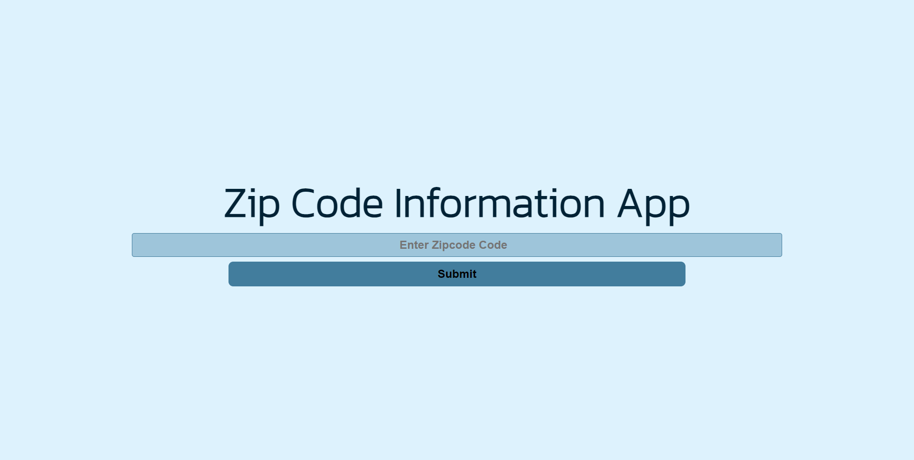
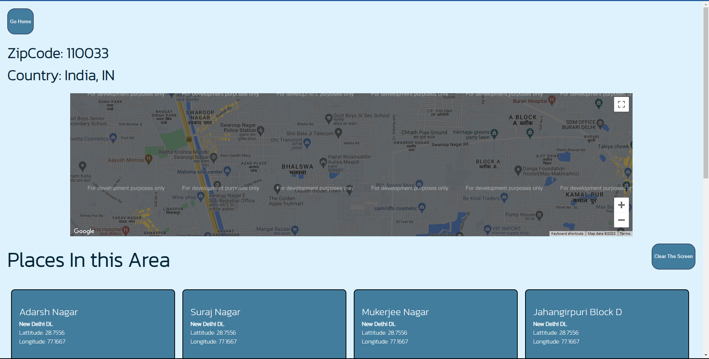
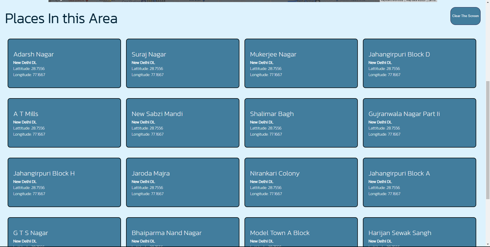
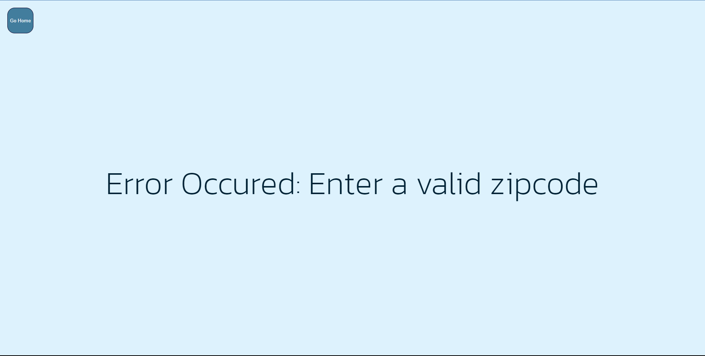

Assignment 1:
Title: Zip Code Information App - React
Description: Create a React application that allows users to enter a postal code and fetch
information about that location using the https://api.zippopotam.us API.
Requirements:
● Create a React app with at least two components: one for entering the postal code and
another for displaying the location information.
● Provide a form or input field where users can enter a postal code.
● When the user submits the postal code, fetch the location information from the API and
store it.
● Display the fetched location information, including the country, state, and place name.
● Handle errors gracefully and display an error message if the API call fails.
● Add a loading indicator to show that data is being fetched.
● Include a button or option to clear the displayed information.
● Style the application using CSS or a CSS framework to make it visually appealing

--------------------------------------------------------------------------------------------------------------------------------

Components Created
 -Search.js
 -Display.js
 -Error.js
 -Loader.js
 -Maps.js
 -MapPlacer.js

Screenshots 

Map
 -The map will have a overlay "For Development purpose only" as the api key has not been used